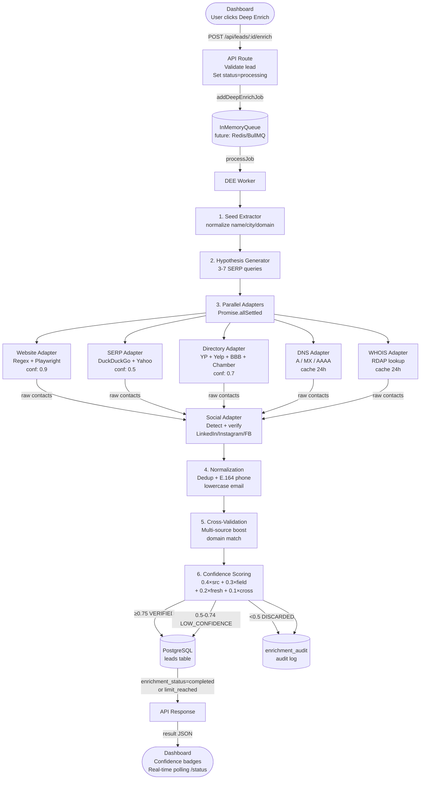

# DEE Architecture & Data Flow

Deep Enrichment Engine (DEE) — XTools Intelligent



## Fallback Chain

```
fetch() → Playwright (JS-heavy sites) → DNS/WHOIS → mark limit_reached
```

## Database Schema

```sql
-- leads table (DEE columns)
ALTER TABLE leads ADD COLUMN verified_emails      TEXT;  -- JSON
ALTER TABLE leads ADD COLUMN verified_phones      TEXT;  -- JSON
ALTER TABLE leads ADD COLUMN verified_socials     TEXT;  -- JSON
ALTER TABLE leads ADD COLUMN confidence_scores    TEXT;  -- JSON
ALTER TABLE leads ADD COLUMN deep_enrichment_json TEXT;
ALTER TABLE leads ADD COLUMN deep_enriched_at     TIMESTAMP;
ALTER TABLE leads ADD COLUMN enrichment_status    TEXT;  -- processing|completed|failed|limit_reached

-- enrichment_audit table
CREATE TABLE enrichment_audit (
  id          SERIAL PRIMARY KEY,
  lead_id     INTEGER REFERENCES leads(id) ON DELETE CASCADE,
  field_name  TEXT NOT NULL,
  value       TEXT NOT NULL,
  source      TEXT NOT NULL,
  confidence  REAL NOT NULL,
  status      TEXT NOT NULL DEFAULT 'pending',
  raw_snippet TEXT,
  created_at  TIMESTAMP DEFAULT CURRENT_TIMESTAMP
);
```

## Confidence Formula

```
confidence = (sourceReliability × 0.4)
           + (fieldMatchScore   × 0.3)
           + (freshnessWeight   × 0.2)
           + (crossValidation   × 0.1)

sourceReliability: website=0.9, directory=0.7, serp=0.5, scrape=0.4
threshold: ≥0.75 → VERIFIED | 0.5–0.74 → LOW_CONFIDENCE | <0.5 → DISCARDED
```

## API Endpoints

| Method | Path | Description |
|--------|------|-------------|
| `POST` | `/api/leads/:id/enrich` | Trigger deep enrichment |
| `GET`  | `/api/leads/:id/enrich/status` | Poll enrichment status |
| `POST` | `/api/deep-enrich` | Legacy endpoint (backward compat) |
| `GET`  | `/api/deep-enrich?id=:id` | Legacy status check |
| `POST` | `/api/admin/purge-pii` | Purge audit log entries older than 7 days |
